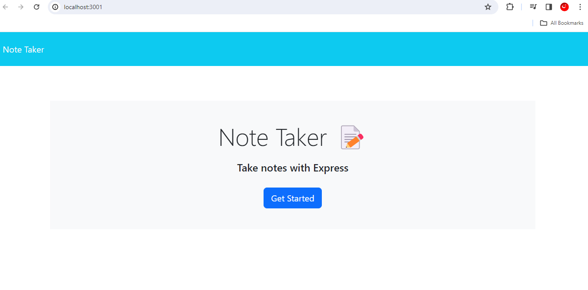
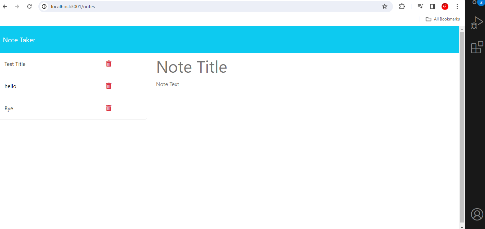

# Express.js (Note-Taker)

## Description

### What was your motivation?
- The motivation behind building the Note Taker application was to create a user friendly tool for taking and organizing notes effectively. With the increasing need for digital organization and productivity tools, having a simple yet powerful note taking application can significantly enhance users dialy workflow and productivity.

### Why did you build this project? 
- The project was built in response to the need for a practical note-taking solution that leverages modern web technologies. By using Express.js for the back end and JSON files for storing note data, the Note Taker application provides a lightweight and efficient platform for users to create, save, and manage their notes seamlessly.

### What problem does it solve?
-  The Note Taker application addresses the common need for a straightforward and intuitive note-taking tool. It provides users with a convenient way to jot down ideas, tasks, or any other information they need to remember, and retrieve them later.

### What did you learn?
- Through building the Note Taker application, several key learnings were gained. Firstly, understanding how to structure and manage routes using Express.js was essential for handling various HTTP requests effectively. Additionally, working with JSON files for data storage taught valuable lessons in file I/O operations and data manipulation. 

## Installation
1. Ensure you have Node.js installed on your system.
2. Clone the repository or download the project files to your local machine.
3. Navigate to the project directory in your terminal.
4. Run `npm install` to install the necessary dependencies.

## Usage
1. Start the application by running `node server.js` or `npm start` in your terminal.
2. Open your web browser and go to `http:://localhost:3000` to access the Note Taker application.

## Screenshots
    

## License
MIT License

Copyright (c) 2024 Joseph Daza

Permission is hereby granted, free of charge, to any person obtaining a copy
of this software and associated documentation files (the "Software"), to deal
in the Software without restriction, including without limitation the rights
to use, copy, modify, merge, publish, distribute, sublicense, and/or sell
copies of the Software, and to permit persons to whom the Software is
furnished to do so, subject to the following conditions:

The above copyright notice and this permission notice shall be included in all
copies or substantial portions of the Software.

THE SOFTWARE IS PROVIDED "AS IS", WITHOUT WARRANTY OF ANY KIND, EXPRESS OR
IMPLIED, INCLUDING BUT NOT LIMITED TO THE WARRANTIES OF MERCHANTABILITY,
FITNESS FOR A PARTICULAR PURPOSE AND NONINFRINGEMENT. IN NO EVENT SHALL THE
AUTHORS OR COPYRIGHT HOLDERS BE LIABLE FOR ANY CLAIM, DAMAGES OR OTHER
LIABILITY, WHETHER IN AN ACTION OF CONTRACT, TORT OR OTHERWISE, ARISING FROM,
OUT OF OR IN CONNECTION WITH THE SOFTWARE OR THE USE OR OTHER DEALINGS IN THE
SOFTWARE.